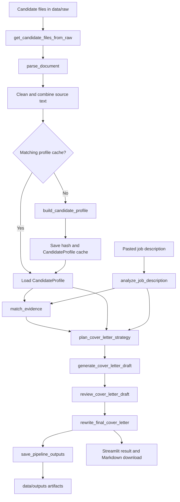

# CoverCraft Agent: Source-Grounded AI Cover Letter Generator

[](https://www.python.org/)
[](https://streamlit.io/)
[](https://platform.openai.com/docs/)
[](https://docs.pydantic.dev/)
[](LICENSE)
[](#project-status-and-known-gaps)
[](#contributing)

CoverCraft Agent turns private candidate source documents and a pasted job description into a personalized, evidence-backed cover letter through a modular LLM pipeline.

> [!IMPORTANT]
> This repository is an educational MVP, not a production hiring system. Generated letters and factual claims must be reviewed by a person before use.

## Contents

- [Overview](#overview)
- [Key Features](#key-features)
- [Architecture](#architecture)
- [Repository Structure](#repository-structure)
- [File-by-File Guide](#file-by-file-guide)
- [Design Decisions](#design-decisions)
- [Pipeline Flow](#pipeline-flow)
- [Model Calls and Optimization](#model-calls-and-optimization)
- [Installation](#installation)
- [Preparing Candidate Source Files](#preparing-candidate-source-files)
- [Usage](#usage)
- [Output Files](#output-files)
- [Configuration](#configuration)
- [Example Workflow](#example-workflow)
- [Known Limitations](#known-limitations)
- [Privacy and Safety](#privacy-and-safety)
- [Project Status and Known Gaps](#project-status-and-known-gaps)
- [Roadmap](#roadmap)
- [Contributing](#contributing)
- [Suggested Development Tasks](#suggested-development-tasks)
- [License](#license)
- [Acknowledgements](#acknowledgements)

## Overview

Writing a strong cover letter requires more than placing a resume and job description in one generic prompt. A useful letter must identify what the employer values, select truthful candidate evidence, choose an appropriate narrative, include supported keywords, and remove claims that the source material cannot justify.

CoverCraft Agent breaks that work into focused stages. It reads supported candidate documents from `data/raw/`, extracts a reusable structured candidate profile, analyzes a separately pasted job description, maps requirements to evidence, plans the letter, creates a draft, critiques it, and performs a final rewrite. The Streamlit interface exposes only the inputs that should change for each application:

- Job description
- Writing method
- Tone
- Length
- Custom instructions
- Whether to use the candidate profile cache

The source-grounded approach is the central design constraint. Candidate facts are extracted into a `CandidateProfile`; job requirements are extracted into a `JobDescriptionAnalysis`; and `EvidenceMap` explicitly separates strong, medium, weak, and unsupported matches. Every downstream prompt instructs the model to use those records rather than inventing qualifications. This cannot guarantee perfect factuality, but it creates a clearer audit trail and reduces unsupported claims compared with an unconstrained one-shot prompt.

## Key Features

### Implemented

- Automatically discovers candidate files directly inside `data/raw/`.
- Supports PDF, DOCX, TXT, and Markdown source files.
- Extracts and normalizes text with `pypdf`, `python-docx`, and shared cleaning utilities.
- Combines multiple candidate documents while preserving source file labels for evidence attribution.
- Builds and validates a structured candidate profile with Pydantic.
- Caches the candidate profile using a SHA-256 hash of the combined source text.
- Analyzes pasted job descriptions into responsibilities, skills, keywords, values, focus areas, and gaps.
- Maps job requirements to candidate evidence by match strength.
- Plans a role-specific writing strategy before drafting.
- Supports selectable writing method, tone, and length plus free-form instructions.
- Generates a first draft, performs one structured critic review, and rewrites a final letter.
- Saves intermediate JSON artifacts and draft/final Markdown files.
- Provides a Streamlit UI for generation, inspection, and final-letter download.
- Exposes a Python runner for programmatic use.

### Not Yet Implemented

- Fast mode or a reduced-call pipeline
- Job-description caching
- Multiple critic/rewrite iterations
- Token and cost reporting
- Per-stage model selection
- PDF or DOCX export
- Automated tests, CI, Docker, and production deployment controls

## Architecture



The LLM-facing agents are deliberately separated from parsing, schemas, caching, orchestration, persistence, and UI code. This keeps each stage inspectable and makes it possible to test or replace one responsibility without rewriting the entire application.

## Repository Structure

The tree below reflects the current repository. Private files inside `data/raw/` are intentionally not named.

```text
CoverCraft_Agent/
|-- app/
|   `-- streamlit_app.py
|-- data/
|   |-- raw/                         # Private candidate source documents
|   |-- processed/
|   |   |-- cache/                   # Created when profile caching is used
|   |   |   `-- candidate_profile_cache.json
|   |   `-- source.json              # Existing artifact; unused by current pipeline
|   `-- outputs/                      # Generated and overwritten on each saved run
|       |-- candidate_profile.json
|       |-- critic_review.json
|       |-- draft_cover_letter.md
|       |-- evidence_map.json
|       |-- final_cover_letter.md
|       |-- full_pipeline_result.json
|       |-- jd_analysis.json
|       `-- strategy.json
|-- prompts/                          # Present but currently empty; prompts live in agents
|-- src/
|   |-- agents/
|   |   |-- candidate_builder.py
|   |   |-- critic.py
|   |   |-- draft_generator.py
|   |   |-- evidence_matcher.py
|   |   |-- final_rewriter.py
|   |   |-- jd_analyzer.py
|   |   `-- strategy_planner.py
|   |-- parsers/
|   |   |-- document_parser.py
|   |   |-- jd_parser.py              # Placeholder
|   |   `-- resume_parser.py          # Placeholder
|   |-- pipeline/
|   |   |-- candidate_profile_cache.py
|   |   |-- run_cover_letter_pipeline.py
|   |   |-- run_from_files.py
|   |   |-- run_from_files_and_save.py
|   |   `-- save_pipeline_outputs.py
|   |-- schemas/
|   |   |-- candidate_schema.py
|   |   |-- evidence_schema.py
|   |   |-- jd_schema.py
|   |   `-- output_schema.py
|   |-- utils/
|   |   |-- file_utils.py
|   |   |-- json_utils.py
|   |   |-- llm_client.py
|   |   `-- text_cleaning.py
|   `-- config.py
|-- tests/                             # Present but currently empty
|-- .gitignore
|-- LICENSE
|-- README.md
|-- requirements.txt
`-- test.py                            # Manual prompt fixture; not a pytest test
```

## File-by-File Guide

### Application and Configuration

| File | Purpose | Key Functions / Classes | Why It Exists |
| --- | --- | --- | --- |
| `app/streamlit_app.py` | Implements the interactive MVP. It lists discovered source file names, accepts the JD and writing preferences, runs the saved pipeline, shows intermediate artifacts, and offers a Markdown download. | Streamlit page declarations; calls `get_candidate_files_from_raw()` and `run_from_files_and_save()` | Keeps presentation and user interaction separate from reusable pipeline logic. |
| `src/config.py` | Loads `.env` and centralizes paths, defaults, supported extensions, model name, and API-key lookup. | `PROJECT_ROOT`, `RAW_DATA_DIR`, `PROCESSED_DATA_DIR`, `OUTPUT_DIR`, `PROMPTS_DIR`, `DEFAULT_MODEL`, `DEFAULT_TONE`, `DEFAULT_METHOD`, `DEFAULT_LENGTH`, `SUPPORTED_DOCUMENT_TYPES`, `OPENAI_API_KEY` | Prevents path and default-value duplication across modules. |

### Parsing and Utilities

| File | Purpose | Key Functions / Classes | Why It Exists |
| --- | --- | --- | --- |
| `src/parsers/document_parser.py` | Detects a file extension, extracts text from PDF/DOCX/TXT/MD, cleans it, rejects empty extraction, and returns metadata. | `get_file_extension()`, `build_document_metadata()`, `read_docx_file()`, `read_pdf_file()`, `read_text_file()`, `parse_document()` | Isolates deterministic document I/O from LLM reasoning. |
| `src/parsers/jd_parser.py` | Placeholder module with no executable parser. Job descriptions currently enter as text and are processed by `jd_analyzer.py`. | None | Reserves a future boundary for file-based or deterministic JD parsing. |
| `src/parsers/resume_parser.py` | Placeholder module with no executable parser. Candidate documents currently use the generic `parse_document()`. | None | Reserves a future resume-specific parser without complicating the MVP. |
| `src/utils/text_cleaning.py` | Normalizes spaces/newlines, standardizes bullet prefixes, deduplicates keyword strings, and prepares text for prompts. | `normalize_whitespace()`, `remove_excess_blank_lines()`, `clean_bullets()`, `split_keywords()`, `prepare_text_for_llm()` | Provides one cleaning policy for extracted documents and pasted text. |
| `src/utils/file_utils.py` | Wraps common directory, text, and JSON persistence operations. | `ensure_directory_exists()`, `file_exists()`, `load_json()`, `load_text()`, `save_json()`, `save_text()` | Keeps filesystem mechanics out of caching and output orchestration. |
| `src/utils/json_utils.py` | Converts model text into a Python dictionary, including responses wrapped in Markdown JSON fences or surrounding text. | `strip_json_code_fence()`, `extract_json_from_response()` | Gives JSON-producing agents consistent parsing and clear failures. |
| `src/utils/llm_client.py` | Validates the OpenAI key, creates the client, and sends prompts through the Responses API. | `validate_api_key()`, `get_openai_client()`, `generate_text()` | Centralizes provider setup, the default model, temperatures, and output limits. |

### Schemas

| File | Purpose | Key Functions / Classes | Why It Exists |
| --- | --- | --- | --- |
| `src/schemas/candidate_schema.py` | Defines the normalized representation extracted from all candidate sources. | `EducationItem`, `ExperienceItem`, `ProjectItem`, `AchievementItem`, `CandidateProfile` | Validates profile fields before downstream agents rely on them. |
| `src/schemas/jd_schema.py` | Defines structured job metadata, responsibilities, skills, keywords, values, focus areas, and gaps. | `JobDescriptionAnalysis` | Turns an unstructured JD into a stable downstream contract. |
| `src/schemas/evidence_schema.py` | Represents supported and unsupported matches between the JD and candidate profile. | `EvidenceMatch`, `UnsupportedRequirement`, `EvidenceMap` | Makes evidence strength and unsupported requirements explicit before writing begins. |
| `src/schemas/output_schema.py` | Defines a richer possible final-output contract with keyword coverage, evidence use, removed claims, review notes, suggestions, and quality score. | `KeywordCoverageItem`, `EvidenceUsedItem`, `UnsupportedClaimItem`, `ReviewNote`, `CoverLetterOutput` | Establishes a future structured final report, but it is not currently used by the orchestrator. |

### Agents

| File | Purpose | Key Functions / Classes | Why It Exists |
| --- | --- | --- | --- |
| `src/agents/candidate_builder.py` | Cleans combined candidate text, asks the model for source-only JSON, parses it, and validates `CandidateProfile`. | `build_candidate_profile_prompt()`, `build_candidate_profile()` | Performs expensive profile extraction once and produces reusable candidate knowledge. |
| `src/agents/jd_analyzer.py` | Extracts structured hiring information from the pasted job description. | `build_jd_analysis_prompt()`, `analyze_job_description()` | Separates role interpretation from candidate interpretation. |
| `src/agents/evidence_matcher.py` | Compares `JobDescriptionAnalysis` with `CandidateProfile` and classifies evidence as strong, medium, weak, or unsupported. | `build_evidence_matching_prompt()`, `match_evidence()` | Prevents the drafting stage from treating every desired skill as an established candidate fact. |
| `src/agents/strategy_planner.py` | Produces a JSON writing plan based on the JD, profile, evidence, method, tone, length, and user instructions. | `build_strategy_prompt()`, `plan_cover_letter_strategy()` | Creates an explicit narrative plan instead of asking one prompt to reason and write simultaneously. |
| `src/agents/draft_generator.py` | Writes the first letter from the validated context and strategy. | `build_draft_prompt()`, `generate_cover_letter_draft()` | Keeps generation independently inspectable and reviewable. |
| `src/agents/critic.py` | Reviews the draft for factual support, missing keywords, generic language, tone, structure, and strategy adherence. | `build_critic_prompt()`, `review_cover_letter_draft()` | Adds a structured quality-control step before final output. |
| `src/agents/final_rewriter.py` | Revises the draft using critic feedback while retaining the same grounded source context. | `build_final_rewrite_prompt()`, `rewrite_final_cover_letter()` | Converts review findings into the final polished letter. |

### Pipeline and Persistence

| File | Purpose | Key Functions / Classes | Why It Exists |
| --- | --- | --- | --- |
| `src/pipeline/candidate_profile_cache.py` | Hashes combined source text, validates cache hits, and stores/loads the profile at `data/processed/cache/candidate_profile_cache.json`. | `get_text_hash()`, `load_cached_candidate_profile()`, `save_candidate_profile_cache()`, `get_or_build_candidate_profile()` | Avoids repeating the most reusable LLM extraction when candidate documents have not changed. |
| `src/pipeline/run_cover_letter_pipeline.py` | Validates inputs and executes every agent in order. Returns metadata and all intermediate/final results. | `validate_pipeline_inputs()`, `run_cover_letter_pipeline()` | Provides the central in-memory orchestration API. |
| `src/pipeline/run_from_files.py` | Discovers supported files in `data/raw/`, parses and combines them, then calls the central pipeline with a text JD. | `get_candidate_files_from_raw()`, `combine_raw_candidate_documents()`, `run_cover_letter_pipeline_from_files()` | Adapts the core pipeline to the repository's folder-based candidate workflow. |
| `src/pipeline/run_from_files_and_save.py` | Runs the folder-based pipeline and persists its outputs. | `run_from_files_and_save()` | Gives the UI and scripts one high-level entry point returning both results and saved paths. |
| `src/pipeline/save_pipeline_outputs.py` | Verifies required result keys and writes two Markdown plus six JSON files. | `REQUIRED_RESULT_KEYS`, `get_output_paths()`, `save_pipeline_outputs()` | Makes intermediate reasoning inspectable and keeps persistence separate from generation. |

### Project Support Files

| File | Purpose | Key Contents | Why It Exists |
| --- | --- | --- | --- |
| `requirements.txt` | Lists runtime and development packages. | OpenAI, Anthropic, python-dotenv, Pydantic, Streamlit, pypdf, python-docx, pytest, Ruff | Provides a single install command. Versions are currently unpinned; Anthropic is installed but unused. |
| `test.py` | Creates synthetic schema objects and prints a critic prompt. It contains no assertions and is not collected as a pytest test. | Manual fixture using `build_critic_prompt()` | Useful for prompt inspection, but not an automated verification suite. |
| `LICENSE` | Grants reuse under the MIT License. | MIT License, copyright 2026 | Defines actual repository licensing terms. |
| `.gitignore` | Excludes environments, secrets, caches, editor files, common documents, and generated output directories. | Ignore patterns | Reduces accidental commits, although tracked candidate files require separate remediation; see [Privacy and Safety](#privacy-and-safety). |

## Design Decisions

### A pipeline instead of one giant prompt

A single prompt would need to parse files, infer the job, locate evidence, plan, write, and self-review at once. The current pipeline assigns one goal to each call. Intermediate outputs can therefore be inspected, saved, validated, or replaced independently. The tradeoff is latency and API cost.

### Deterministic parsing before LLM reasoning

`document_parser.py` handles formats and text extraction without an LLM. Agents receive normalized text rather than file objects, which makes format handling testable and keeps provider-specific code out of the parser.

### Pydantic at critical boundaries

Candidate, JD, and evidence responses are converted from model JSON into Pydantic objects. This catches missing structural assumptions and invalid match-strength values before later stages use them. Strategy and critic responses remain plain dictionaries, so their internal shapes are not yet validated.

### JSON between analysis agents

Extraction, matching, planning, and critique prompts request JSON. Named fields are easier to validate and inspect than prose and allow later stages to address specific evidence or review findings. Draft and final rewrite stages return plain text because their primary artifact is the letter itself.

### Candidate profile caching

Candidate evidence usually changes less often than job descriptions. `get_text_hash()` hashes the exact combined text; a matching hash loads the stored `CandidateProfile`, while changed source text causes a rebuild. This normally removes one LLM call from later applications without silently using a profile built from different source text.

### `data/raw/` as the candidate knowledge source

The folder is a simple local knowledge boundary for the MVP. The app automatically loads every supported file directly inside it, so users do not repeatedly upload the same resume, project notes, or professional profile. Discovery is non-recursive: supported files in subdirectories are not loaded.

### The job description stays separate

The JD changes for every application and should not become candidate evidence. Supplying it in the UI prevents accidental contamination of the profile cache and lets the same candidate profile be reused across roles.

### Critic and final rewrite

The initial draft is not treated as final. `review_cover_letter_draft()` returns targeted feedback, then `rewrite_final_cover_letter()` receives that feedback along with the original source-grounded context. One review/rewrite cycle is implemented; repeated cycles are future work.

### JSON and Markdown output files

JSON preserves structured intermediate artifacts for debugging, evaluation, or future interfaces. Markdown keeps the draft and final letter human-readable and portable. The current saver uses fixed filenames, so each run overwrites the previous run.

### Streamlit for the MVP

Streamlit provides controls, progress feedback, JSON inspection, and a download button with little UI infrastructure. It is appropriate for a local portfolio MVP, although it does not provide authentication, multi-user isolation, background jobs, or persistent application history.

### Prompting rather than fine-tuning

The current implementation uses explicit prompts and source context through the OpenAI Responses API. It includes no training or fine-tuning pipeline. That choice keeps the MVP easier to inspect and update while the workflow and evaluation criteria are still evolving.

## Pipeline Flow

1. **Discover candidate documents.** `get_candidate_files_from_raw()` in `src/pipeline/run_from_files.py` checks that `data/raw/` exists, selects direct child files whose lowercase suffix appears in `SUPPORTED_DOCUMENT_TYPES`, sorts them, and rejects an empty set.
2. **Extract and clean text.** `combine_raw_candidate_documents()` calls `parse_document()` for each file. The parser selects PDF, DOCX, or text extraction; `prepare_text_for_llm()` normalizes bullets and whitespace; then the combiner adds a `SOURCE FILE` label and joins sections.
3. **Load or build the candidate profile.** `run_cover_letter_pipeline()` calls `get_or_build_candidate_profile()`. With caching enabled, it compares the SHA-256 source hash with the cache. A miss calls `build_candidate_profile()` and stores the validated profile.
4. **Analyze the job description.** `analyze_job_description()` cleans the pasted JD, requests structured JSON, parses it, and validates it as `JobDescriptionAnalysis`.
5. **Match evidence.** `match_evidence()` compares the JD analysis with `CandidateProfile`, returning a validated `EvidenceMap` of strong, medium, weak, and unsupported requirements.
6. **Plan the writing strategy.** `plan_cover_letter_strategy()` incorporates the method, tone, length, user instructions, and all structured context. It returns a dictionary describing the opening, body goals, evidence, keywords, closing, and material to avoid.
7. **Generate the first draft.** `generate_cover_letter_draft()` asks the model to follow the plan, use supported keywords naturally, and avoid unsupported facts.
8. **Review the draft.** `review_cover_letter_draft()` checks truthfulness, specificity, missing keywords, generic phrases, tone, structure, and requested constraints. It returns structured review JSON.
9. **Create the final rewrite.** `rewrite_final_cover_letter()` applies the critic feedback while receiving the original profile, JD, evidence map, and strategy again for grounding.
10. **Save the run.** `save_pipeline_outputs()` writes all implemented artifacts to `data/outputs/` under fixed filenames.
11. **Display the result.** `app/streamlit_app.py` shows the final letter, expandable draft/JD/evidence/critic views, output paths, and a Markdown download button.

## Model Calls and Optimization

### Calls in a full run

| Stage | Function | Typical call status |
| --- | --- | --- |
| Candidate profile extraction | `build_candidate_profile()` | Called on a cold cache or when caching is disabled |
| Job description analysis | `analyze_job_description()` | Always called |
| Evidence matching | `match_evidence()` | Always called |
| Strategy planning | `plan_cover_letter_strategy()` | Always called |
| Draft generation | `generate_cover_letter_draft()` | Always called |
| Critic review | `review_cover_letter_draft()` | Always called |
| Final rewrite | `rewrite_final_cover_letter()` | Always called |

A cold cached run makes seven LLM calls. A valid candidate-profile cache hit makes six. Disabling caching also makes seven and does not refresh the existing cache.

### Implemented optimizations

- **Candidate profile cache:** keyed by a SHA-256 hash of the combined candidate text.
- **Saved intermediate outputs:** avoids losing results and supports inspection without rerunning solely to see prior stage data.
- **Per-stage output limits and temperatures:** extraction/review calls use lower temperatures, while drafting and rewriting allow modestly more variation.

There is currently no fast mode, JD cache, prompt-response cache, automatic retry, usage accounting, or conditional skip for the critic.

### Future optimization opportunities

- Cache JD analysis by a stable hash of cleaned JD text.
- Optionally combine strategy planning and first-draft generation.
- Add a cheaper reduced-stage fast mode.
- Add configurable critic/rewrite iterations instead of always exactly one.
- Add a user feedback checkpoint before final rewriting.
- Record tokens, latency, and estimated cost per stage.
- Select models independently for extraction, reasoning, drafting, and review.
- Use provider-supported structured output where available instead of parsing free-form JSON text.

## Installation

### Prerequisites

- Python 3.10 or newer (`str | Path` type syntax requires 3.10+)
- An OpenAI API key
- Git

### 1. Clone the repository

```bash
git clone <repository-url>
cd CoverCraft_Agent
```

### 2. Create and activate a virtual environment

macOS or Linux:

```bash
python -m venv .venv
source .venv/bin/activate
```

Windows PowerShell:

```powershell
python -m venv .venv
.\.venv\Scripts\Activate.ps1
```

### 3. Install dependencies

```bash
python -m pip install --upgrade pip
pip install -r requirements.txt
```

### 4. Create `.env`

The repository does not currently include an `.env.example`. Create a local `.env` in the project root:

```dotenv
OPENAI_API_KEY=your_api_key_here
```

Do not commit this file. `src/config.py` loads it with `python-dotenv`, and `src/utils/llm_client.py` raises `ValueError("OPENAI_API_KEY is missing.")` if it is unavailable.

## Preparing Candidate Source Files

Place candidate-owned evidence such as a resume, professional profile, project notes, motivation notes, education, or achievements inside `data/raw/`.

Supported extensions are defined by `SUPPORTED_DOCUMENT_TYPES`:

| Extension | Parser |
| --- | --- |
| `.pdf` | `pypdf.PdfReader` |
| `.docx` | `python-docx.Document` |
| `.txt` | UTF-8 text reader |
| `.md` | UTF-8 text reader |

Guidelines:

- Keep source facts truthful, current, and sufficiently specific.
- Use text-based PDFs. Scanned/image-only PDFs have no OCR path and may produce no text.
- Put files directly in `data/raw/`; nested folders are not searched.
- Do not put job descriptions in `data/raw/`. Paste the JD into the app or runner for each application.
- Avoid duplicate or contradictory documents because all supported files are combined.
- Treat the raw files and generated cache as private candidate data.

Recommended privacy-focused `.gitignore` rules:

```gitignore
.env
!.env.example
data/raw/*
!data/raw/.gitkeep
data/processed/cache/
data/processed/source.json
data/outputs/
```

Adding ignore rules does not remove files already tracked by Git. See [Privacy and Safety](#privacy-and-safety) before publishing the repository.

## Usage

### Option A: Streamlit app

From the repository root:

```bash
streamlit run app/streamlit_app.py
```

In the UI:

1. Confirm that the sidebar finds the expected candidate source file names.
2. Leave **Use candidate profile cache** enabled for normal repeated use, or disable it for an uncached run.
3. Paste the full job description.
4. Select a writing method, tone, and length.
5. Add optional custom instructions.
6. Click **Generate Cover Letter**.
7. Review the final letter and the expandable JD analysis, evidence map, draft, and critic review.
8. Download the final letter as `final_cover_letter.md`.

Current writing-method options:

- `storyline with STAR-style evidence`
- `direct professional cover letter`
- `achievement-focused cover letter`
- `mission-alignment cover letter`
- `career-transition explanation`

Current tone options:

- `professional, warm, confident`
- `concise and direct`
- `enthusiastic but not exaggerated`
- `polished and formal`
- `human, natural, and sincere`

Current length options are `short`, `medium`, and `detailed`.

### Option B: Python

Run the actual high-level folder-and-save API from the repository root:

```python
from src.pipeline.run_from_files_and_save import run_from_files_and_save

output = run_from_files_and_save(
    job_description_text="""Paste the complete job description here.""",
    method="storyline with STAR-style evidence",
    tone="professional, warm, confident",
    length="medium",
    user_instructions="Make it specific, natural, and concise.",
    use_candidate_cache=True,
)

print(output["result"]["final_letter"])
print(output["result"]["metadata"])
print(output["saved_paths"])
```

`run_from_files_and_save()` accepts optional `raw_data_dir` and `output_dir` arguments for alternate local paths. For an in-memory workflow with candidate text already available, use `run_cover_letter_pipeline()` from `src/pipeline/run_cover_letter_pipeline.py`.

## Output Files

Every saved run writes the following artifacts to `data/outputs/`:

| Output File | Description |
| --- | --- |
| `final_cover_letter.md` | Final letter after critic-guided rewriting |
| `draft_cover_letter.md` | First draft before critic feedback is applied |
| `candidate_profile.json` | Validated structured profile used in the run |
| `jd_analysis.json` | Validated structured analysis of the pasted JD |
| `evidence_map.json` | Strong, medium, weak, and unsupported requirement mappings |
| `strategy.json` | Writing plan returned by the strategy agent |
| `critic_review.json` | Structured draft score, issues, risks, and revision instructions |
| `full_pipeline_result.json` | Metadata plus every intermediate artifact and final letter |

The candidate cache is separate:

| Cache File | Description |
| --- | --- |
| `data/processed/cache/candidate_profile_cache.json` | Source hash and serialized `CandidateProfile` |

All output filenames are fixed. A new run overwrites the prior files; version history is not implemented.

## Configuration

`src/config.py` contains the current application settings:

| Setting | Current Value | Used For |
| --- | --- | --- |
| `PROJECT_ROOT` | Parent directory of `src/` | Stable base for all local paths |
| `DATA_DIR` | `<project>/data` | Data root |
| `RAW_DATA_DIR` | `<project>/data/raw` | Candidate source discovery |
| `PROCESSED_DATA_DIR` | `<project>/data/processed` | Candidate cache parent |
| `OUTPUT_DIR` | `<project>/data/outputs` | Saved run artifacts |
| `PROMPTS_DIR` | `<project>/prompts` | Reserved path; currently unused |
| `DEFAULT_MODEL` | `gpt-4.1-mini` | Default OpenAI model for every stage |
| `DEFAULT_TONE` | `professional, warm, confident` | Default pipeline tone |
| `DEFAULT_METHOD` | `storyline with STAR-style evidence` | Default planning method |
| `DEFAULT_LENGTH` | `medium` | Default requested length |
| `SUPPORTED_DOCUMENT_TYPES` | `.md`, `.txt`, `.docx`, `.pdf` | Candidate file filtering |
| `OPENAI_API_KEY` | Loaded from environment | OpenAI client authentication |

### Environment variables

| Variable | Required | Status |
| --- | --- | --- |
| `OPENAI_API_KEY` | Yes | Used by `get_openai_client()` |
| `ANTHROPIC_API_KEY` | No | Commented out in config; Anthropic is not used by the pipeline |

The dependency list currently includes `anthropic`, but no source module imports or calls it.

## Example Workflow

1. Add candidate source files such as `resume.pdf`, `profile.md`, and `projects.docx` to `data/raw/`.
2. Start the app with `streamlit run app/streamlit_app.py`.
3. Verify the sidebar reports three supported source files.
4. Paste a target job description into the JD field.
5. Select `storyline with STAR-style evidence`, `professional, warm, confident`, and `medium`.
6. Add a targeted instruction, then generate the letter.
7. Inspect `evidence_map.json` or the Evidence Map expander to confirm important claims have explicit support.
8. Read the Critic Review and compare the first draft with the final rewrite.
9. Edit the final letter as needed and download the Markdown file.
10. For a second JD with unchanged candidate documents, leave caching enabled so profile extraction is skipped.

### Example custom instructions

- `Make it warm, concise, and not overly formal.`
- `Highlight my machine learning and data pipeline experience.`
- `Focus on mission alignment and research experience.`
- `Avoid generic phrases and keep sentences short.`
- `Use a confident but humble tone.`
- `Do not mention work authorization.`
- `Prioritize evidence from projects over coursework.`

Custom instructions guide generation; they do not authorize invented facts. Candidate claims must still be present in the source documents.

## Known Limitations

- LLM output can contain mistakes even when prompts require source grounding.
- Every final letter requires human factual, grammatical, and strategic review before submission.
- Output quality depends on the completeness, clarity, consistency, and freshness of candidate source documents.
- PDF extraction does not support OCR for scanned or image-only files.
- File discovery reads only the immediate children of `data/raw/`.
- Long source files increase input tokens, latency, and API cost; the app has no chunking or context-budget management.
- Every uncached stage is sequential, so full runs can be slow.
- API calls can fail due to credentials, quotas, network conditions, model availability, or malformed model JSON.
- There is no retry/backoff, timeout policy, or graceful partial-result recovery.
- Strategy and critic dictionaries are not validated by dedicated Pydantic schemas.
- `CoverLetterOutput` exists but is not used to validate the final pipeline result.
- Saved outputs use fixed names and overwrite earlier applications.
- The local Streamlit app has no authentication or multi-user data isolation.
- Dependency versions are unpinned, which can make future installs non-reproducible.

## Privacy and Safety

Candidate documents may include names, contact information, employment history, education, work authorization, and other sensitive career data. The generated profile, intermediate JSON, cache, draft, and final letter can repeat that information.

Before publishing or sharing this repository:

1. Do not commit `.env`, API keys, resumes, profiles, project notes, caches, or generated letters.
2. Add explicit ignore rules for `data/raw/`, `data/processed/cache/`, `data/processed/source.json`, and `data/outputs/`.
3. Remove sensitive files that are already tracked from the Git index and, if necessary, repository history.
4. Rotate any secret that may have been committed previously.
5. Review generated outputs before sending them to an employer or another service.
6. Understand the data-handling terms of the configured LLM provider before submitting personal information.

At the time of this README audit, Git reports candidate files under `data/raw/` and `data/processed/source.json` as tracked. Existing `.gitignore` rules do not retroactively protect tracked files. Their contents were not inspected for this documentation, but they should be treated as private and remediated before the repository is made public.

## Project Status and Known Gaps

The end-to-end MVP is implemented: folder parsing, candidate caching, JD analysis, evidence matching, planning, drafting, one critic pass, final rewriting, persistence, and Streamlit display all have connected code paths.

The repository is still in development:

- `src/parsers/jd_parser.py` and `src/parsers/resume_parser.py` are placeholders.
- `prompts/` is empty because prompts are currently inline in agent modules.
- `tests/` is empty. `pytest` reports no collected tests.
- `test.py` is a manual prompt-printing fixture, not an automated test.
- `.env.example` is missing and the current `.gitignore` pattern `.env.*` would ignore one if added without an exception.
- Ruff currently reports unused imports/variables and import-order findings.
- `EvidenceMatch` declares `skills_connected` twice; the latter declaration replaces the former in the class body.
- The candidate builder's empty-input error has no explanatory message.
- Several agent prompts return dictionaries without Pydantic validation.
- OpenAI responses are requested as text and parsed manually rather than constrained with provider-native structured output.
- Generated output and cache files can contain personal information and need explicit repository hygiene.

## Roadmap

### Quality and evaluation

- Add configurable multiple critic/rewrite iterations; one iteration already exists.
- Add a user feedback checkpoint after draft generation.
- Validate strategy and critic output with dedicated Pydantic models.
- Activate `CoverLetterOutput` or replace it with a schema matching the actual final result.
- Add evidence-coverage and hallucination-risk metrics.
- Add regression fixtures and evaluations for source faithfulness, relevance, tone, and keyword use.

### Performance and observability

- Cache JD analysis by cleaned-text hash.
- Add a candidate-profile refresh button that rebuilds and replaces the cache.
- Add a reduced-call fast mode.
- Record token usage, latency, and estimated cost per stage.
- Add model selection per pipeline step.
- Add retries with bounded backoff and clearer provider errors.
- Add context-size controls, document chunking, and source deduplication.

### Product capabilities

- Export final letters to PDF and DOCX.
- Add cover-letter version history instead of overwriting fixed filenames.
- Add an application tracker.
- Add a resume-tailoring module.
- Add an application email generation module.
- Support multiple isolated candidate profiles.
- Add editable draft feedback and approval before final rewriting.

### Engineering

- Add unit tests for parsers, cleaning, JSON extraction, caching, schemas, saving, and orchestration.
- Add mocked integration tests for every agent boundary.
- Add a CI workflow for Ruff and pytest.
- Pin dependency versions or adopt a lockfile.
- Add Docker support.
- Add a safe `.env.example` and correct its ignore exception.
- Move reusable prompt templates into `prompts/` or remove the unused directory.
- Add package metadata and documented Python-version constraints.

## Contributing

Contributions should preserve the project's core requirement: candidate claims must remain traceable to source material.

1. Fork the repository.
2. Create a focused branch: `git checkout -b feature/short-description`.
3. Make the change and add or update tests.
4. Run local checks.
5. Confirm no private documents, generated profiles, outputs, or secrets are staged.
6. Update this README when behavior, configuration, file structure, or user workflow changes.
7. Open a pull request explaining the behavior and verification performed.

Recommended checks:

```bash
ruff check app src tests
pytest -q
python -m compileall -q app src
```

Code expectations:

- Keep functions focused and modules aligned with existing responsibility boundaries.
- Keep prompts separate from pipeline orchestration.
- Prefer structured schemas over undocumented dictionaries for stable interfaces.
- Avoid hardcoded absolute paths; use `src/config.py` or explicit parameters.
- Add concise docstrings to new public modules and functions.
- Mock LLM calls in unit tests; automated tests should not spend API credits.
- Never commit secrets or candidate data.
- Document planned behavior as planned rather than presenting it as implemented.

## Suggested Development Tasks

| Area | Task | Difficulty | Rationale |
| --- | --- | --- | --- |
| Privacy | Untrack candidate artifacts and add explicit data ignore rules | Easy | Required before public release |
| Testing | Add unit tests for text, JSON, file, parser, and cache utilities | Easy | Deterministic modules can be covered without API calls |
| Schemas | Add typed strategy and critic response models | Easy | Converts two unvalidated agent boundaries into explicit contracts |
| UI | Add a candidate-cache refresh control | Easy | Current checkbox bypasses but does not replace the cache |
| Caching | Add JD analysis caching | Medium | Removes a repeated extraction call for the same role |
| Quality | Add configurable critic/rewrite iterations | Medium | Extends the existing single review cycle |
| Export | Add PDF and DOCX downloads | Medium | Produces application-ready formats |
| Observability | Add per-stage token, latency, and cost logging | Medium | Makes the seven-call workflow measurable |
| Reliability | Add structured-output requests and retry handling | Medium | Reduces failures from malformed JSON or transient API errors |
| CI | Add GitHub Actions for Ruff and pytest | Easy | Prevents known lint/test regressions |
| Packaging | Pin compatible dependencies and declare Python support | Easy | Improves reproducibility |

## License

This project is licensed under the [MIT License](LICENSE).

## Acknowledgements

- [OpenAI](https://openai.com/) for the Responses API used by all current LLM stages
- [Streamlit](https://streamlit.io/) for the local interactive interface
- [Pydantic](https://docs.pydantic.dev/) for structured validation
- [pypdf](https://pypdf.readthedocs.io/) for PDF text extraction
- [python-docx](https://python-docx.readthedocs.io/) for DOCX parsing
- [python-dotenv](https://github.com/theskumar/python-dotenv) for local environment loading
- [pytest](https://pytest.org/) and [Ruff](https://docs.astral.sh/ruff/) for the intended testing and linting workflow

---

Built as a modular educational project for transparent, source-grounded job application writing.
